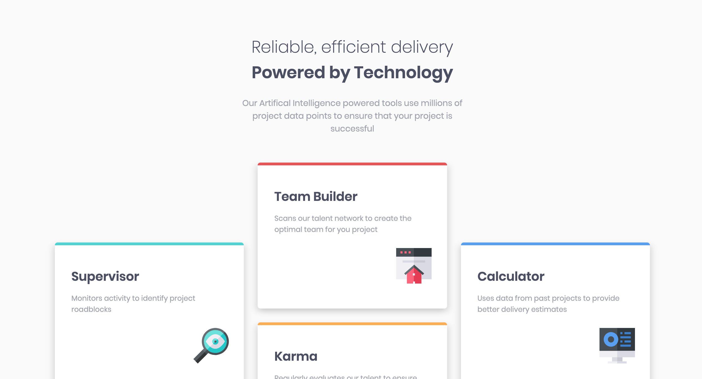
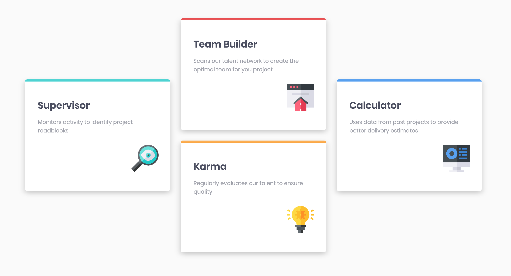

# Four Card Feature Section

Made a modern design four card feature section to practice CSS basic components, css grid and media queries. It was a solution for a task provided on https://www.frontendmentor.io/ .

# Demo

# Technologies Used

HTML5, Plain CSS

# Website

https://buigabor.github.io/four-card-feature-section/
